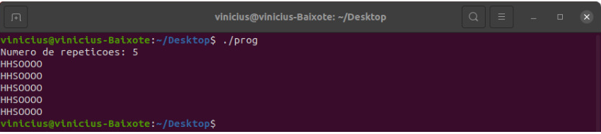

# Trabalho TT_304 - Sistemas Operacionais
**VexorDevs** - Vinícius Fiorio Ribeiro dos Santos 167864

### Descrição do Trabalho
O trabalho é compostos por 2 etapas:
1. Utilizando o serviço da _Amazon Web Services_, criar e configurar uma instância _Amazon Elastic Compute Cloud_(Amazon EC2), com alguns requisitos mínimos:
    - Arquitetura x86, com 64 bits.
      - 4 CPUs Virtuais.
    - 4 Gigabytes de memória principal
    - Memória Secundária:
      - 10 Gigabytes de armazenamento SSD
      - 200 Gigabytes de armazenamento Cold HDD
    - Sistema Operacional Linux (qualquer distribuição)  
 - O vídeo do processo da criação da instância pode ser visto neste link: [Video Criação Instância](www.google.com) , nesta instância devemos realizar a tarefa de programação que envolve threads e semáforos.
    
2. A tarefa de programação consiste em desenvolver um código que por meio do uso de semáforos e da biblioteca pthread consiga "alinhar" os threads que estão sendo executados ao mesmo tempo e em loop infinito para que a saída do programa seja uma sequência de elementos químicos "HHSOOOO" e esse processo deve se repetir a quantidade de vezes que o usuário determinou. Além de termos alguns requisitos como:

- [x] Utilizar a biblioteca Pthreads
- [x] Utilizar semáforos
- [x] Não alterar a estrutura padrão dos threads (deixar em loop infinito)
- [x] Não adicionar nenhuma estrutura de repetição

### Exemplo 
Aqui está um exemplo da saída que o programa retorna:
  

_Você pode visualizar o codigo que foi desenvolvido e executá-lo, para isso você deve seguir alguns passos:_
### Instalando o GCC
1. Baixe o arquivo **main.c** que está disponível nesse mesmo repositório.
2. Após isso em seu terminal execute os seguintes comandos para podermos compilar o nosso arquivo sem problemas.
3. Para atualizar os pacotes do seu terminal ``` sudo apt update ```
4. Para instalar o gcc (Gnu Compiler Collection)  ``` sudo apt install build-essential ```. Confirme digitando 'Y'.
5. Para verificarmos se o gcc foi corretamente instalado degite em seu terminal ``` gcc --version ```.

### Compilando e Executando o arquivo
1. Encontre o local do arquivo que foi baixado.
2. Compile o programa da seguinte forma ```gcc main.c -pthread -o prog```. Em algumas distribuições possa ser que vc tenha que alterar a flag ```-pthread``` para  ```-lpthread```. 
3. Isso irá criar um arquivo chamado **prog**.
4. Para executar esse arquivo digite ```./prog```.
5. Caso não apareça nenhuma mensagem de erro, quer dizer que o programa foi compilado e executado com sucesso.

### Utilizando o programa
1. Logo após o programa ser executado na primeira linha aparecerá o seguinte: 
> Numero de repeticoes: 
2. Onde você deverá digitar um número inteiro positivo qualquer.
3. Por exemplo, se você digitar o número **3**, O programa deve responder como saída o seguinte:
> HHSOOOO  
> HHSOOOO  
> HHSOOOO  
4. Após imprimir a sequência o programa é encerrado, caso queira utilizar novamente basta refazer os passos anteriores de execução.
